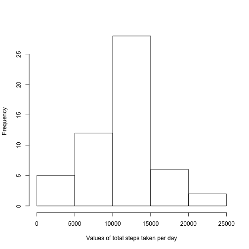
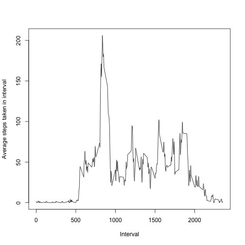
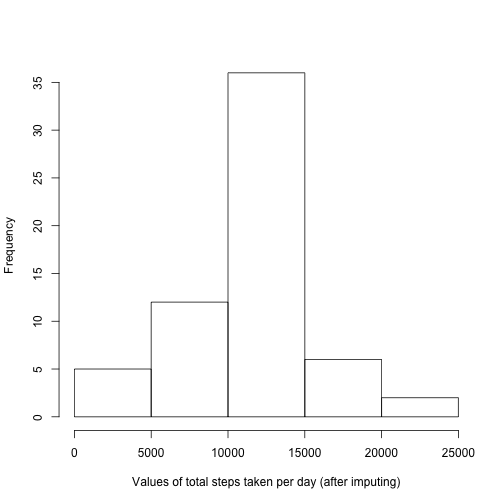
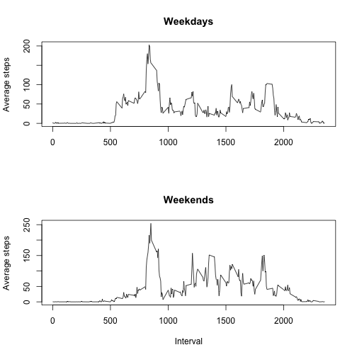

## Initial setup


```r
library(dplyr)
library(lubridate)
options(scipen=999) # Prevent scientific notation in results
```

## Read in input file


```r
act_data <- read.csv('activity.csv')
```

## Transformations

* The code below converts the 'date' field to an R date
* It also creates a new data frame with the missing values filtered out.


```r
act_data$date <- as.Date(act_data$date, '%Y-%m-%d')
act_data_nomissing <- act_data %>% filter(!is.na(steps))
```

## Questions

### What is mean total number of steps taken per day?  


```r
daily.steps <- act_data_nomissing %>% group_by(date) %>% summarize(totsteps = sum(steps))
hist(daily.steps$totsteps, xlab='Values of total steps taken per day', main='')
```



```r
daily.mean.total.steps <- mean(daily.steps$totsteps)
daily.median.total.steps <- median(daily.steps$totsteps)
```

* The mean total number of steps taken per day is **10766.1886792**.
* The median total number of steps taken per day is **10765**.

### What is average daily pattern?  


```r
interval.steps <- act_data_nomissing %>% group_by(interval) %>% summarize(avsteps = mean(steps))
with(interval.steps, plot(interval, avsteps, type='l', xlab='Interval', ylab='Average steps taken in interval'))
```



```r
maxsteps.interval.index <- which.max(interval.steps$avsteps)
maxsteps.interval <- interval.steps[maxsteps.interval.index, ]$interval

#print (as.data.frame(interval.steps))
```

* The interval with the maximum number of steps on average is **835**.

### Imputing missing values

* The strategy used for imputing missing values is to consider, for every missing value, the mean number of steps for that interval.


```r
num.of.missing.values <- nrow(act_data[is.na(act_data$steps),])

get_mean_steps_for_interval <- function(interval) {
  ix = which(interval.steps$interval == interval)
  if (length(ix) != 0) {interval.steps$avsteps[ix]} else {NA}
}

meansteps.vector = mapply(get_mean_steps_for_interval, act_data$interval)

impute_steps <- function(df) {
  ifelse(is.na(df$steps), meansteps.vector, df$steps)
}

act_data_imputed <- act_data %>% mutate(imputedsteps = impute_steps(act_data))

daily.steps.imputed <- act_data_imputed %>% group_by(date) %>% summarize(totsteps = sum(imputedsteps))
hist(daily.steps.imputed$totsteps, xlab='Values of total steps taken per day (after imputing)', main='')
```



```r
daily.mean.total.steps.imputed <- mean(daily.steps.imputed$totsteps)
daily.median.total.steps.imputed <- median(daily.steps.imputed$totsteps)
```

* The total number of missing values is **2304**.
* The mean total number of steps taken per day (after imputing) is **10766.1886792**.
* The median total number of steps taken per day (after imputing) is **10766.1886792**.
* The mean does not differ at all (after imputing), because the imputed value uses the mean value for all intervals.
* The median has changed slightly from **10765** to **10766.1886792**.

### Are there differences in activity patterns between weekdays and weekends?


```r
get_day_type = function(date) {
  day.num = wday(date)
  as.factor(ifelse(day.num == 6 | day.num == 7, 'weekend', 'weekday'))
}

act_data_imputed <- act_data_imputed %>% mutate(day.type = get_day_type(date))

weekday.interval.steps <- act_data_imputed %>%
  filter(day.type == 'weekday') %>%
  group_by(interval) %>%
  summarize(avsteps = mean(imputedsteps))

weekend.interval.steps <- act_data_imputed %>%
  filter(day.type == 'weekend') %>%
  group_by(interval) %>%
  summarize(avsteps = mean(imputedsteps))

par(mfrow = c(2,1))
with(weekday.interval.steps, plot(interval, avsteps, type='l', main='Weekdays', xlab='', ylab='Average steps'))
with(weekend.interval.steps, plot(interval, avsteps, type='l', main='Weekends', xlab='Interval', ylab='Average steps'))
```



* There are some differences in activity patterns between weekdays and weekends.
* Specifically, intervals from 500-750 have lower activity on weekends than on weekdays (perhaps this suggests 'sleeping in'?)
* Also, intervals from 1250-1500 have lower activity on weekdays than on weekends (this may suggest that the person has a sitting office job or is a student).
